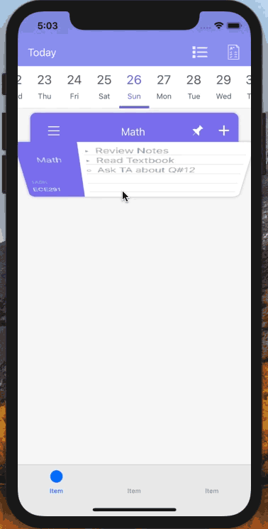
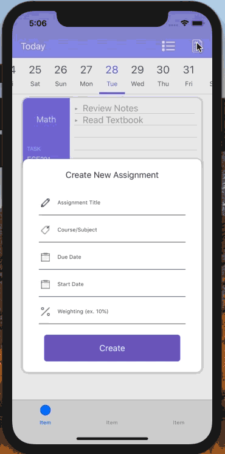

# TudyStudyPlanner
Study Planner app to help students with their studies

# Introduction
An App made for students to aid with their studies. Tudy :

1) Tracks Tasks, Subtasks, and days passed on tasks that were not completed
2) Tracks Assignments, its weighting, tasks and subtasks that are needed to be done, the days passed on tasks that were not completed, and Days left until the Assignment Deadline
3) Tracks Course Assignments and the Course GPAs
4) Displays an inspriational Quote of the day

Pinned Tasks are tasks that are repeatedly done. 

# TudyStudyPlanner
    
